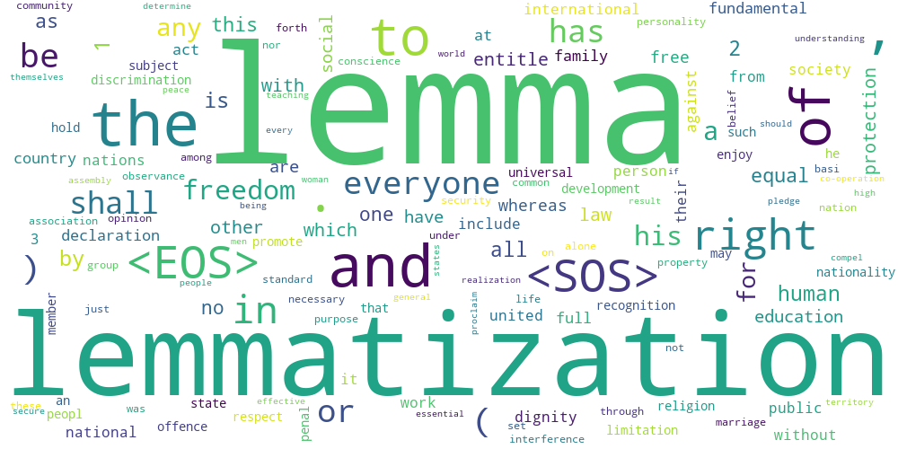

# Lemmatization 

__Anish Sachdeva (DTU/2K16/MC/013)__

__Natural Language Processing - Dr. Seba Susan__

 

## Overview

## Introduction

## Implementation

## Results

## Analytics & Discussion

## Running Project Locally
Clone the repository on your machine and enter the project directory
```powershell
git clone https://github.com/anishLearnsToCode/lemmatization.git
cd lemmatization
cd src
```

Load in the Resume and create a stemmed and lemmatized output 
```powershell
python stem_resume.py
python lemmatize_resume.py
```

See the outputs of the original, stemmed and lemmatized resumes: 
```powershell
python output_resume.py
python output_setmmed.py
python output_lemmatized.py
```

Run the Analytics on the Stemmed and Lemmatized outputs
```powershell
python analytics.py
```

## Bibliography
